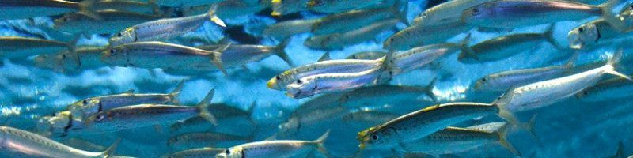

&nbsp;


&nbsp;


&nbsp;

<style>
  .col2 {
    columns: 2 200px;         /* number of columns and width in pixels*/
    -webkit-columns: 2 200px; /* chrome, safari */
    -moz-columns: 2 200px;    /* firefox */
  }
  .col3 {
    columns: 3 100px;
    -webkit-columns: 3 100px;
    -moz-columns: 3 100px;
  }
  .col4 {
    columns: 4 100px;
    -webkit-columns: 4 100px;
    -moz-columns: 4 100px;
  }
</style>

```{r setup, include=FALSE}
library(dplyr)
library(knitr)
knitr::opts_chunk$set(echo = FALSE)


```
***

### Project details

```{r ProjDets, eval=T}
dat<-data.frame(c("Funding body","Funding stream","Contract ID","Project Partners","Collaborators"),
                 c("Pew Charitable Trusts",
                   "International Fisheries (Aquaculture Taskforce Feasibility Study – PDE)",
                   "#36211",
                   "Blue Matter Science Ltd.",
                   "Tom Carruthers"))

kable(dat,col.names=rep("",2)) 
 

```

&nbsp;
&nbsp;


***

### Principal Research Questions

* Is it possible and practical to manage a stock like Peruvian Anchoveta, and its boom-and-bust
population cycles, with a harvest strategy informed by a management strategy evaluation?

* What other management approaches/measures (e.g., spatial measures) and considerations,
consistent with precautionary ecosystem-based fisheries management, may be applicable?


&nbsp;
&nbsp;

***

### Project status (0%)

All methods and draft papers complete:

* An individual tagging model has been integrated into the the MSE framework
* 


&nbsp;
&nbsp;

***

### Links 

<div class="col2">

[Anchoveta MSE GitHub Repository](https://github.com/Blue-Matter/Anchoveta MSE/)

[Draft Report)](https://docs.google.com/document/d/1SYY8692lybi8d1tWeWUGGOlFiExEBEoJNpnuRanUrHM/edit)

[OM Technical Specification Report](Reports/Peruvian_Anchoveta.html)

</div>

&nbsp;
&nbsp;

***

### Code to run example CMPs

Bla bla:

```{r packageinstall,echo=T, eval=FALSE}


```


### Demonstration Code

```{r demo, echo=TRUE, eval=FALSE}

  
```


&nbsp;
&nbsp;


***
### References

[NOAA BTRP](https://www.fisheries.noaa.gov/grant/bluefin-tuna-research-program)

[The Ocean Foundation](https://oceanfdn.org/)

[Blue Matter](https://www.bluematterscience.com/)

&nbsp;
&nbsp;

***

### Acknowledgements

This work was funded by a US National Oceanic and Atmospheric Adiministration grant.


&nbsp;
&nbsp;
&nbsp;
&nbsp;
&nbsp;
&nbsp;

