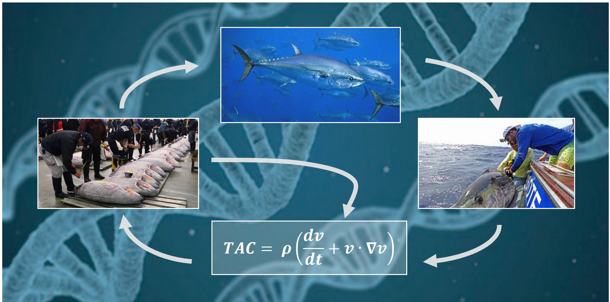

&nbsp;


&nbsp;


&nbsp;

<style>
  .col2 {
    columns: 2 200px;         /* number of columns and width in pixels*/
    -webkit-columns: 2 200px; /* chrome, safari */
    -moz-columns: 2 200px;    /* firefox */
  }
  .col3 {
    columns: 3 100px;
    -webkit-columns: 3 100px;
    -moz-columns: 3 100px;
  }
  .col4 {
    columns: 4 100px;
    -webkit-columns: 4 100px;
    -moz-columns: 4 100px;
  }
</style>

```{r setup, include=FALSE}
library(dplyr)
library(knitr)
knitr::opts_chunk$set(echo = FALSE)


```
***

### Project details

```{r ProjDets, eval=T}
dat<-data.frame(c("Funding body","Funding stream","NOAA Award Number",
"Request for proposals","Project Partners","Collaborators"),
                 c("U.S. National Oceanic and Atmospheric Administration",
                   "FY21 Bluefin Tuna Research Program",
                   "NA21NMF4720304",
                   "NOAA-NMFS-SE-2021-2006574",
                   "The Ocean Foundation, Blue Matter Science Ltd.",
                   "Tom Carruthers, Shana Miller, Matt Lauretta, Doug Butterworth, Ann Preece, Nathan Taylor, Quang Huynh, Adrian Hordyk"))

kable(dat,col.names=rep("",2)) 
 

```

&nbsp;
&nbsp;


***

### Project description

The objective of this project is to use existing operating models for Atlantic bluefin tuna to evaluate the potential performance of harvest strategies that use conventional gene tagging data. 

(more detail and references to come)

&nbsp;
&nbsp;

***

### Project status (100%)

All methods and draft papers complete:

* An individual tagging model has been integrated into the the MSE framework
* Observed tag histories are now available to MPs for the setting of management advice
* A multiyear TMB Brownie estimator has been developed and tested 
* Estimation performance has been evaluated for alternative tagging designs, release numbers, fishery exploitation rates and operating models
* Harvest strategy performance has been evaluated for varying tag release numbers and compared with a perfect information constant harvest policy
* An initial draft of the of the paper has been produced (See below)
* Additionally a draft SCRS paper has been produced for feedback from the ICCAT species group members

Final steps: 

1. Consolidate feedback from authors of the peer review paper
2. Format peer-review paper for submission and submit
3. Update the MP results on the ABTMSE shiny App
4. Draft final project report to NOAA (Sept 30 2022)

&nbsp;
&nbsp;

***

### Links 

<div class="col2">

[ABTGT GitHub Repository](https://github.com/Blue-Matter/ABTGT/)

[Draft paper (private Google Doc for collaborators)](https://docs.google.com/document/d/1DduUQIQQrJFBXquaoPXIjKMvuVVZMYQf9H6phEI_uGQ/edit?usp=sharing)

[Draft SCRS paper](Manuscripts/SCRS 2022 Carruthers Gene Tagging Draft 1.pdf)

[Atlantic bluefin tuna MSE framework and operating models](https://iccat.github.io/abft-mse/)


</div>

&nbsp;
&nbsp;

***

### Installation of R packages

These instructions assume you have an up-to-date copy of R and an appropriate editor such as RStudio

The latest ABTMSE R package can be downloaded from [here](https://drive.google.com/drive/folders/1ZR3IudYH8ABcweWO_hWbO1uhImFzFFPm?usp=sharing)  

You can install it from the RStudio menu: Tools/Install Packages/Install from: Package Archive File

You will need to install a number of ABTMSE package dependencies using this code:

```{r packageinstall,echo=T, eval=FALSE}

packages<-c("roxygen2","snowfall","maps","mapdata",
  "wordcloud","abind","PBSmapping","MASS",
  "shiny","parallel","lubridate","rmarkdown","knitr",
  "mvtnorm","ggplot2","kableExtra","DT","geoR",
  "shinyBS","shinyWidgets","fmsb","viridis",
  "reldist","quantreg")

ipak <- function(pkg){
  new.pkg <- pkg[!(pkg %in% installed.packages()[, "Package"])]
  if (length(new.pkg))
    install.packages(new.pkg, dependencies = TRUE)
  sapply(pkg, require, character.only = TRUE)
}

ipak(packages)

```

Lastly, install the ABTGT R package:

```{r ABTGTinstall,echo=T, eval=FALSE}

install.packages('devtools')
devtools::install_github("blue-matter/ABTGT")

```

### Demonstration Code

```{r demo, echo=TRUE, eval=FALSE}

library(ABTMSE) # The ABT MSE R package
library(ABTGT)  # The ABT Gene Tagging package
loadABT()       # Load all MSE objects (OMs, observation error models etc)

findy('OM')     # list the OMs in the ABTGT package, avail('OM') finds those in the ABTMSE package

# Note that these are named according to OM number (MSE framework) and then a package of 10 simulations (to keep memory requirements modest)
OM<-OM_25_3     # is operating model #25 from the MSE and the third package of 10 simulations (5 packages in total)

# Tagging design object 
findy('RD') # list the release designs

GT <- make_GT(OM,nT=500*OM@proyears, RD="E_Tag")  # a gene tag object with 500 annual releases and E-tagging release distribution

# Test that the TMB brownie estimator is working
Brownie(test_data,fix_M=T,M=0.25)$report$F # instantaneous F estimates

# If you get an error like: 
# Error in inDL(x, as.logical(local), as.logical(now), ...) : 
#  unable to load shared object 'C:/GitHub/ABTGT/Brownie/brownie.dll':
#  LoadLibrary failure:  The specified module could not be found.

# you can search your computer for the brownie.dll file and update its location (and then try again):
pkg.globals$BrownieFile<-"C:/GitHub/ABTGT/ABTGT/Brownie/brownie.dll" # new location (this is something specific to your computer)

# Now take a look at the GT MP options that are available

findy('MSMP') # find the gene tagging MPs of the multiyear tagging estimator  

# !! This will take ~ 30 minutes !!
MSE<-new('MSE_GT',OM,list(c("GT4","GT4"),c("GT5","GT5")),GT=GT) # run a projection for a 4% and 5% target exploitation rate

# plot some SSB/SSBMSY trajectories

stock<-1 # Eastern Stock
plotyears<-OM@nyears+1:OM@proyears
yearlab<-2019+1:OM@proyears
matplot(yearlab,t(MSE@B_BMSY[2, ,stock,plotyears]),type="l",col="red",xlab="Year",ylab="SSB/SSBMSY")
matplot(yearlab,t(MSE@B_BMSY[1, ,stock,plotyears]),type="l",add=T,col="green")
legend('bottomleft',legend=c("GT4","GT5"),text.col=c("green","red"),bty='n')

# You can also look at the tag history data

MP<-1
MSE@PPD[[MP]][[stock]]$TH # tag histories dimensions are tagnumber, simulation, stock, projection year, season (1s are releases, negative numbers are captures by a fleet, e.g. -16 is a capture by the 16th fleet "RRUSAFB": OM@Fleets$name[16])
MSE@PPD[[MP]][[stock]]$CN # observed catch numbers
MSE@PPD[[MP]][[stock]]$N # true simulated numbers at age

# if you want to format these simulated data for use in the Brownie estimator you can do this with:
simno<-1
post_tag_dat<-get_my_tag_data(simno,MSE@PPD[[MP]],stock)
est<-Brownie(post_tag_dat,M=mean(OM@M),fix_M=T)
plot(est$report$F)
  
```


&nbsp;
&nbsp;


***
### References

[NOAA BTRP](https://www.fisheries.noaa.gov/grant/bluefin-tuna-research-program)

[The Ocean Foundation](https://oceanfdn.org/)

[Blue Matter](https://www.bluematterscience.com/)

&nbsp;
&nbsp;

***

### Acknowledgements

This work was funded by a US National Oceanic and Atmospheric Adiministration grant.


&nbsp;
&nbsp;
&nbsp;
&nbsp;
&nbsp;
&nbsp;

