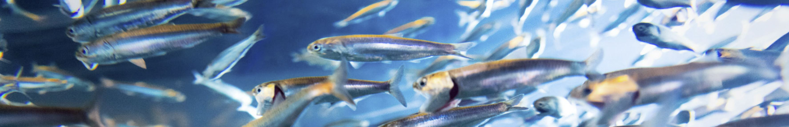

 


 


 

<style>
  .col2 {
    columns: 2 200px;         /* number of columns and width in pixels*/
    -webkit-columns: 2 200px; /* chrome, safari */
    -moz-columns: 2 200px;    /* firefox */
  }
  .col3 {
    columns: 3 100px;
    -webkit-columns: 3 100px;
    -moz-columns: 3 100px;
  }
  .col4 {
    columns: 4 100px;
    -webkit-columns: 4 100px;
    -moz-columns: 4 100px;
  }
</style>

```{r setup, include=FALSE}
library(dplyr)
library(knitr)
knitr::opts_chunk$set(echo = FALSE)


```

***

### Project details

```{r ProjDets, eval=T}
dat<-data.frame(c("Funding body","Funding stream","Contract ID","Project Partners","Collaborators"),
                 c("Pew Charitable Trusts",
                   "International Fisheries (Aquaculture Taskforce Feasibility Study – PDE)",
                   "#36211",
                   "Blue Matter Science Ltd.",
                   "Tom Carruthers"))

kable(dat,col.names=rep("",2)) 
 

```

&nbsp;
&nbsp;


***

### Principal Research Questions

* Is it possible and practical to manage a stock like Peruvian Anchoveta, and its boom-and-bust
population cycles, with a harvest strategy informed by a management strategy evaluation?

* What other management approaches/measures (e.g., spatial measures) and considerations,
consistent with precautionary ecosystem-based fisheries management, may be applicable?


&nbsp;
&nbsp;

***

### Project status (33%)

Completed:

* Operating model specified and fitted

In progress:

* Designing and running a range of harvest strategies
* Write up results in a draft report (see below)

&nbsp;
&nbsp;

***
### Draft Report

A private Google doc is available [here](https://docs.google.com/document/d/1SYY8692lybi8d1tWeWUGGOlFiExEBEoJNpnuRanUrHM/edit). 

Please email tom@bluematterscience.com to request access.  

&nbsp;
&nbsp;

***

### Appendices

A detailed description of the Reference Case operating model is available in [Appendix 1](Reports/Peruvian_Anchoveta.html) which includes justifications and references in support of the various population and fishing dynamics. 

The operating model was conditioned on publicly available data published in [Oliveros-Ramos 2010](Paper/Oliveros - Ramos 2010.pdf). Operating model estimates and statistical properties of model fit are available in a detailed [operating model conditioning report](Reports/RCM.html)

&nbsp;
&nbsp;

***

### Apps

The Reference Case operating model has been uploaded to the [Reference Point Calculator App](apps.bluematterscience.com/RPC). 

Once you have selected this case study you can investigate historical reference points and test a range of harvest strategies. 

&nbsp;
&nbsp;

***

### Source Code and Objects 

The raw code and openMSE objects required to run the MSE are available in the public [Anchoveta MSE GitHub Repository](https://github.com/Blue-Matter/Anchoveta MSE/)

Code is provided below on how to install and run examples from the package. 

&nbsp;
&nbsp;

***

### Running an example MSE for Anchoveta

The operating model is available from a R package in a GitHub repository. You can install it from GitHub:

```{r packageinstall,echo=T, eval=FALSE}
install.packages(devtools)
devtools::install_github('blue-matter/AnchovettaMSE')
library(AnchovettaMSE)

```

&nbsp;
&nbsp;

***

### Demonstration Code

```{r demo, echo=TRUE, eval=FALSE}
library(openMSE)
library(AnchovettaMSE)

avail('MP') # a list of available MPs. Those starting 'PA' are designed for use with Peruvian Anchoveta

avail('OM') # a list of operating models. Those starting 'PA' are Peruvian Anchoveta operating models
testMSE<-runMSE(PA_RefCase,MPs=c("PA_F30","PA_F40"))
plot(testMSE)
  
```


&nbsp;
&nbsp;


***

### Background documents and referenced material

<div class="col2">

2010 Stock Assessment ([Oliveros - Ramos, 2010](Papers/Oliveros - Ramos 2010.pdf))

Climate change and Anchoveta ([Oliveros - Ramos et al. 2021](Papers/fao-667-14-Oliveros_etal-2021-anchovy_climate_change.pdf))

Growth, Egg production ([Perea et al. 2011](Papers/Potential_egg_production_recruitment_and_closed_fi.pdf))

</div>

&nbsp;
&nbsp;

***

### Links

[The Pew Charitable Trusts](https://www.pewtrusts.org/en/)

[Blue Matter](https://www.bluematterscience.com/)

[IMARPE](https://www.gob.pe/imarpe)

&nbsp;
&nbsp;

***

### Acknowledgements

This work was funded by The Pew Charitable Trusts. Many thanks to Ashley Wilson for guidance during project development and scoping. 


&nbsp;
&nbsp;
&nbsp;
&nbsp;
&nbsp;
&nbsp;

